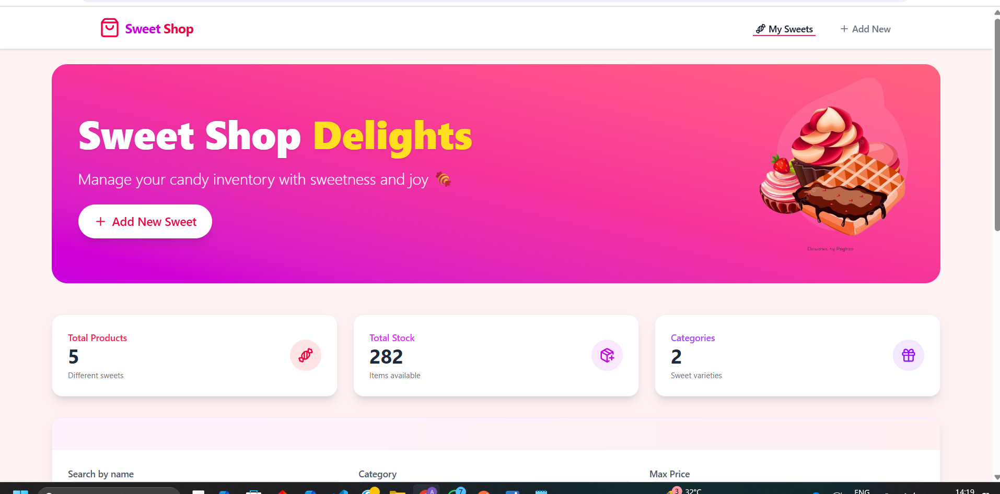
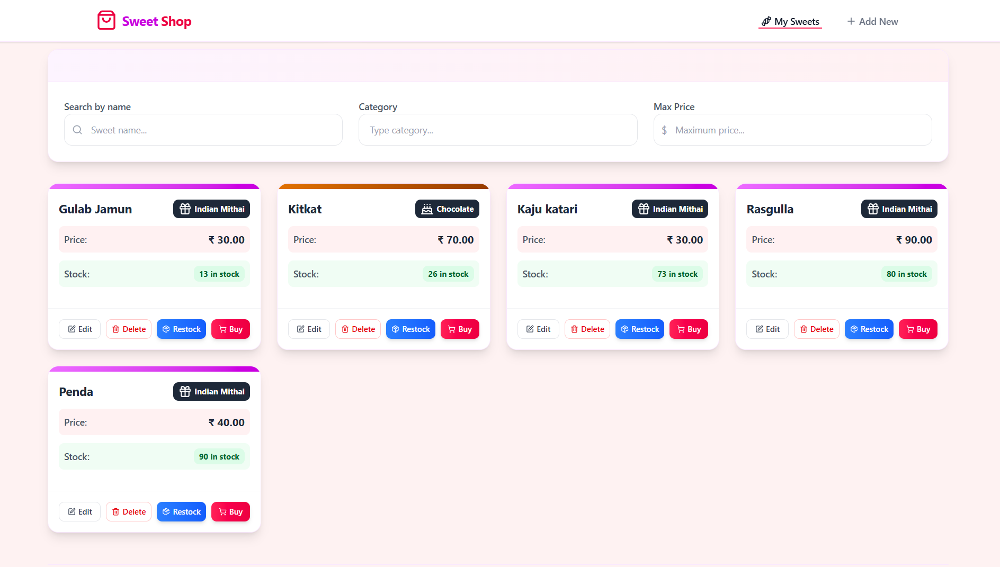

# 🍭 Sweet Shop Inventory System

A full-stack Sweet Shop Inventory Management app developed using **TDD (Test-Driven Development)** methodology. It features a React + Tailwind frontend and an Express.js + MongoDB backend, fully tested using Jest and Supertest.

---

## 🚀 Getting Started

### 1. Clone the Repository

```bash
git clone https://github.com/Avani-prajapati/sweet-shop-management-system-TDD.git
cd sweet-shop-management-system-TDD
```

### 2. Install Backend Dependencies

```bash
npm install
```

### 3. Install Frontend Dependencies

```bash
cd client
npm install
```

---

## 🪪 Running Tests

Make sure MongoDB is running locally or remotely.

Then, from the root directory:

```bash
npm run test
```

This will execute all **unit** and **integration** tests.

---

### Developer Mode

1. Build the React frontend:

```bash
cd frontend
npm run dev
```

2. In app.js, change NODE_ENV to developer:

```bash
NODE_ENV=developer
npm start
```

---

## 📁 Project Structure

```
.
├── client/                  # Frontend code
├── node_modules/            # Node.js dependencies
├── src/                     # Backend source code
│   ├── config/              # Configuration files
│   ├── controllers/         # Route controllers
│   ├── models/              # Database models
│   ├── routers/             # Route definitions
│   ├── services/            # Business logic/services
│   └── app.js               # Main application entry point
├── tests/                   # Test files
│   ├── integrationTest/     # Integration tests
│   └── unitTest/            # Unit tests
├── .env                     # Environment variables
├── .gitignore               # Git ignore rules
├── package-lock.json        # Dependency lock file
├── package.json             # Project metadata and dependencies
└── README.md                # Project documentation
```

---

## 🔐 Environment Variables

Create a `.env` file in the root:

```
PORT=5000
MONGO_URL=your_developer_mongo_url
MONGO_TEST_URL=your_testing_mongo_url
```

---

## 🎨 UI Preview





---

## 🔍 Key Features

* Add, edit, delete sweets
* Purchase and restock flow
* Filtering sweets by name, category, and price
* Responsive and aesthetic UI using TailwindCSS
* Backend tests with 90% coverage

---

## 🤖 AI Tools Used

* **ChatGPT** – assisted in backend logic & test writing
* **Deepseek** – helped generate starter frontend structure

---

## 🧑‍🏫 Author

#### [Avani-Prajapati](https://github.com/Avani-prajapati) 
---

